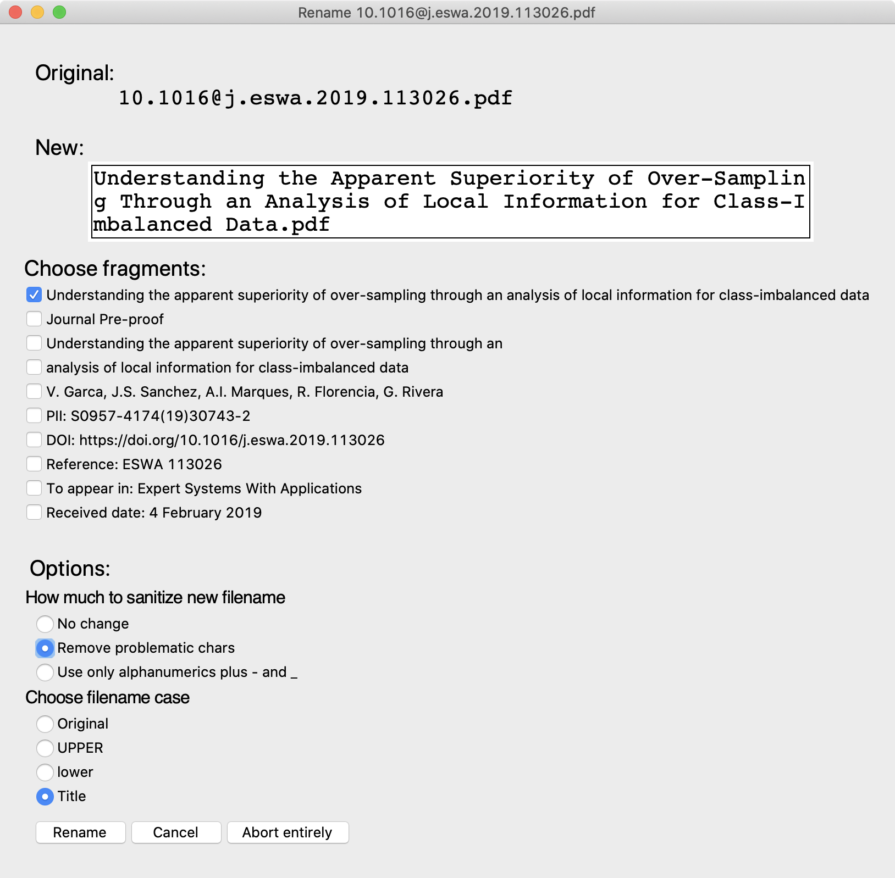

# rename_papers

---

## Introduction

*rename_papers* is a simple program to extract the title from a PDF file, manipulate it, and rename the file.  It does this with a GUI (tkinter) so you're able to select various fragments comprising the new file name, and various operations on the filename.  Here's an example:

## Requirements

- tkinter (provided with Python)
- pdftotext
